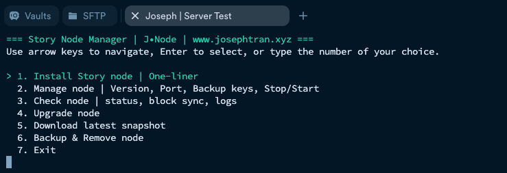
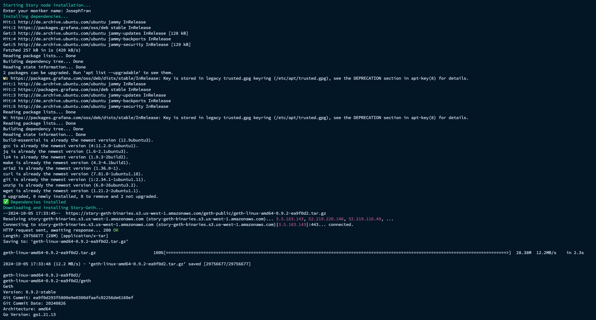
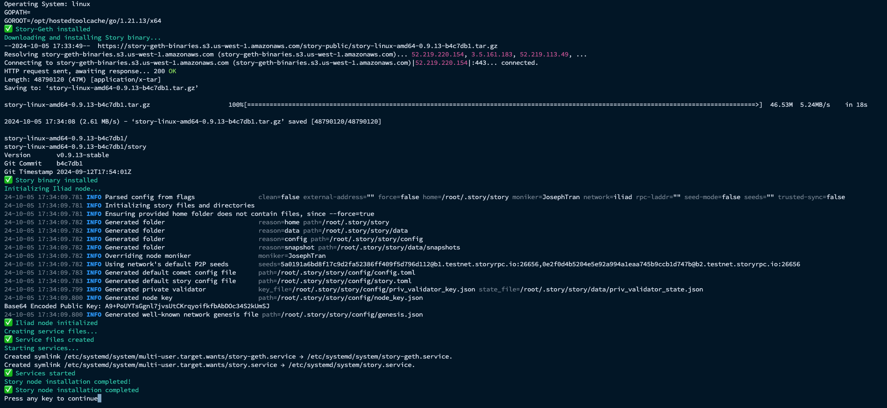
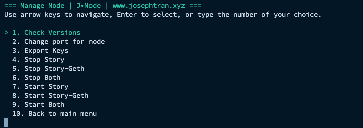
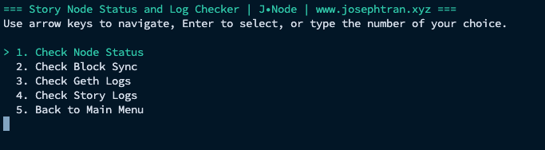
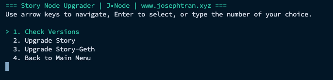
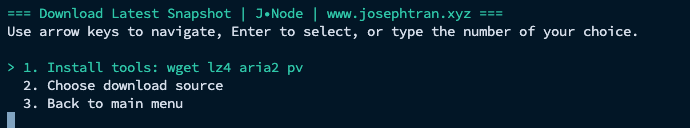
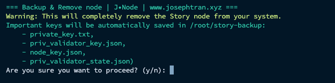

# Story Node Manager User Guide

# Introduction

Story Node Manager is a comprehensive tool designed to simplify the process of managing a Story node. With its user-friendly command-line interface, it allows users to easily install, manage, upgrade, and monitor their Story nodes.

# Installation
To start using the Story Node Manager, run the following command in your terminal:
```
bash <(curl -s https://story.josephtran.co/scripts/story-manager-v0.1.0.sh)
```
## 1. Main Menu

After running the script, you'll see the main menu with the following options:



Features
1. Install Story node | One-liner
This option allows you to install the Story node with a single command. It will automatically download and install all necessary components.





2. Manage node | Version, Port, Backup keys, Stop/Start
This menu provides various management options for your Story node:

Check the current version
Change the node port
Backup your keys
Stop or start the node



3. Check node | status, block sync, logs
This submenu offers different ways to monitor your node:

Check Node Status: View the current status of your node
Check Block Sync: Monitor the synchronization progress
Check Geth Logs: View the Geth client logs
Check Story Logs: View the Story node logs



4. Upgrade node
Use this option to upgrade your Story node to the latest version.



5. Download latest snapshot
This option allows you to download the latest blockchain snapshot, which can significantly reduce the time needed for initial synchronization.



6. Backup & Remove node
This option guides you through the process of backing up your node data and then removing the node from your system.



7. Exit
Selecting this option will exit the Story Node Manager.
Navigation Tips

Use the arrow keys to move up and down in the menu.
Press Enter to select an option.
You can also type the number of your choice to quickly select an option.

Support
For more information or support, visit `www.josephtran.xyz` or join our community channels.
Thank you for using Story Node Manager!
